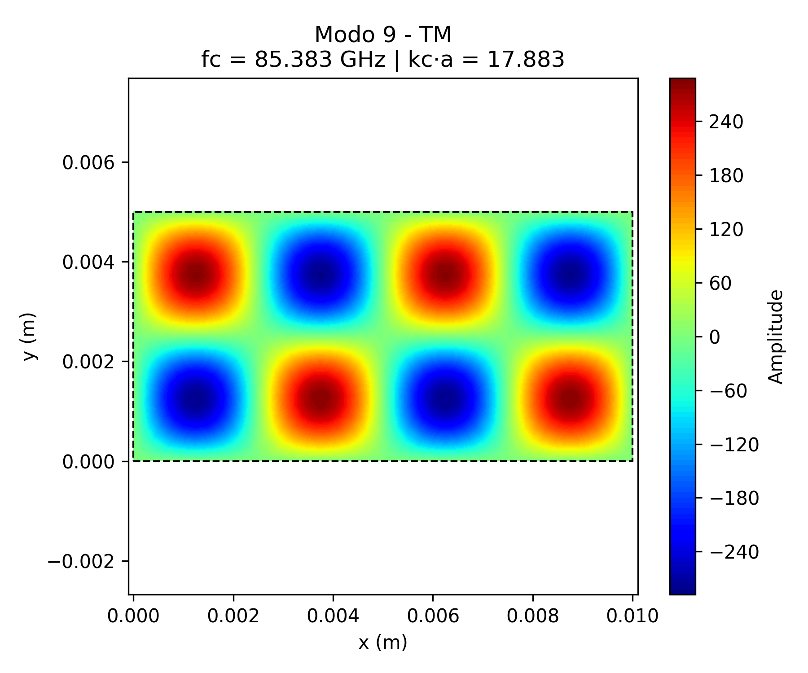

# Resultados – Modos TM (Componente Escalar Ez)

Este documento apresenta os gráficos dos modos TM simulados com o método dos elementos finitos (FEM), considerando um guia de onda **retangular com proporção $` a = 2b `$**.

Cada figura representa a distribuição espacial da componente longitudinal do campo elétrico $` E_z `$.

---

## Modo TM 1

## Modo TM 2

## Modo TM 3

## Modo TM 4

## Modo TM 5

## Modo TM 6

## Modo TM 7

## Modo TM 8

## Modo TM 9

## Modo TM 10

## Modo TM 11

## Modo TM 12

