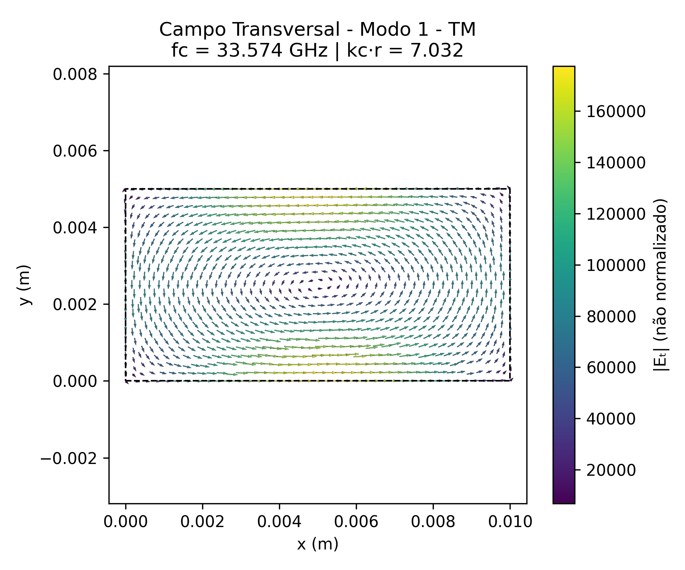
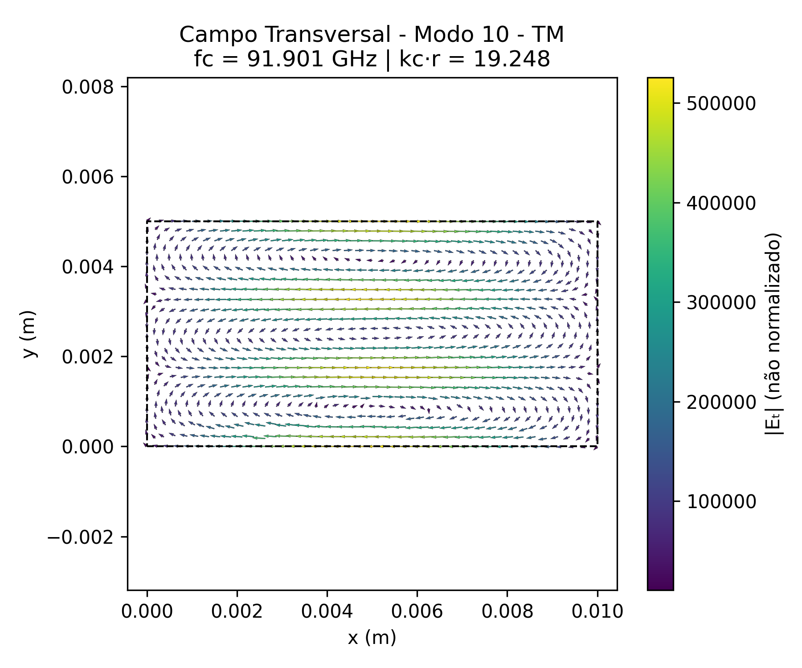

# Resultados – Modos TM (Campo Transversal)

Este documento apresenta os gráficos vetoriais dos modos TM, representando o campo elétrico transversal obtido a partir da componente $` E_z `$ em um guia de onda **retangular com proporção $` a = 2b `$**.

As setas indicam a direção e intensidade relativa dos vetores, com coloração baseada na magnitude.

---

## Campo Transversal – Modo TM 1

## Campo Transversal – Modo TM 2

## Campo Transversal – Modo TM 3

## Campo Transversal – Modo TM 4

## Campo Transversal – Modo TM 5

## Campo Transversal – Modo TM 6

## Campo Transversal – Modo TM 7

## Campo Transversal – Modo TM 8

## Campo Transversal – Modo TM 9

## Campo Transversal – Modo TM 10

## Campo Transversal – Modo TM 11

## Campo Transversal – Modo TM 12

